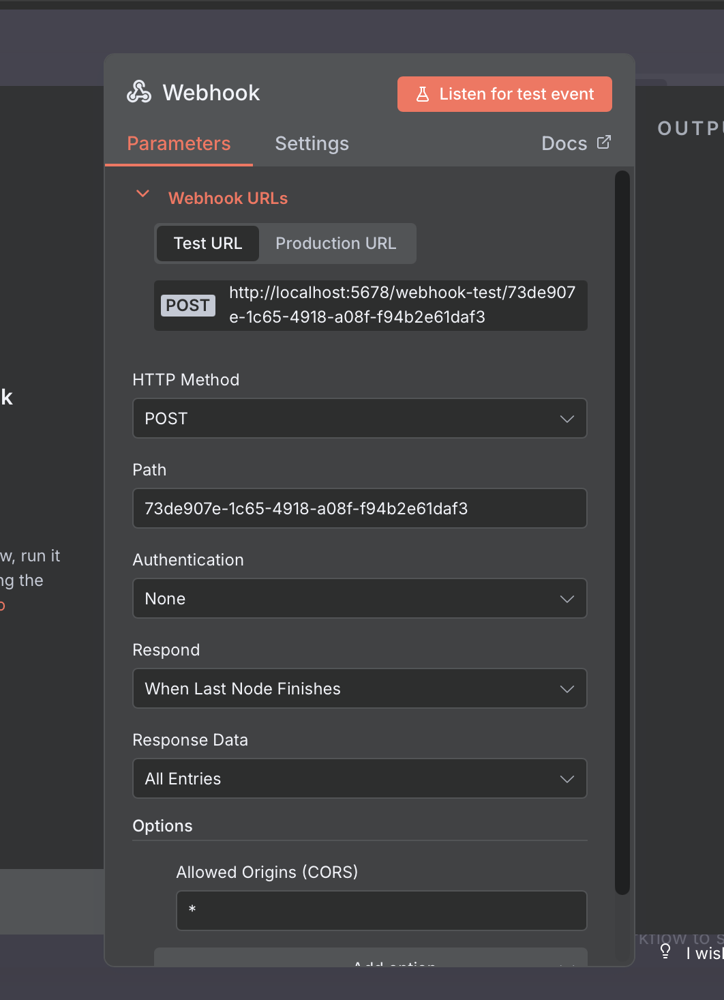
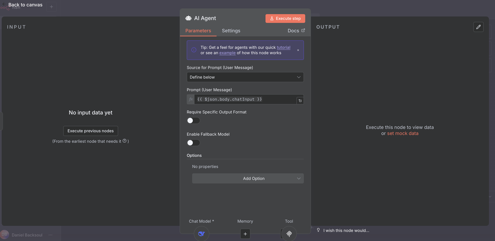
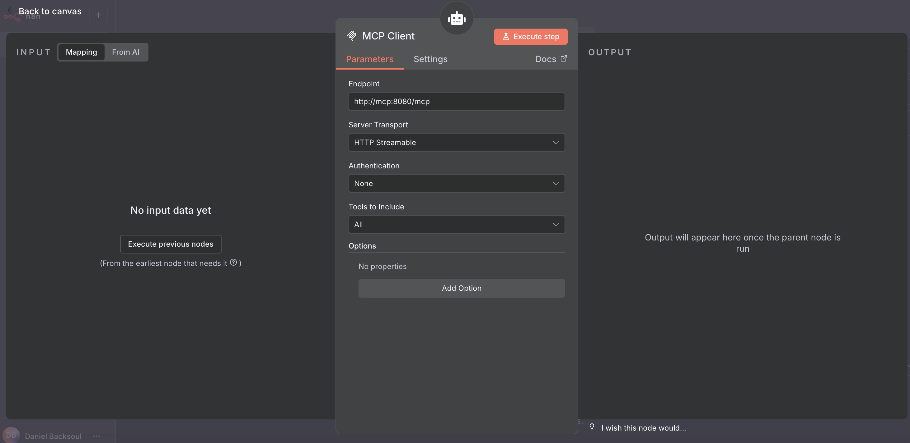
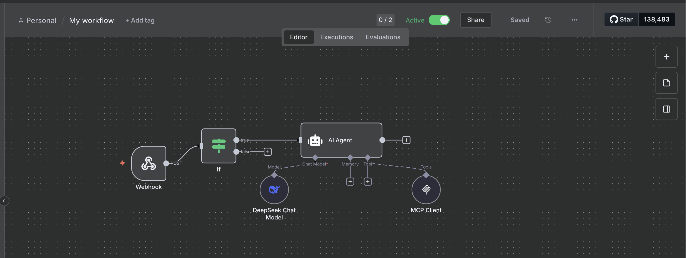

# mcp-server

Servidor Model Context Protocol (MCP) construido con mcp-framework.

## 1. Instalación y ejecución

1. Instala las dependencias:

   ```bash
   npm install
   ```

2. Compila el proyecto (esto es necesario cada vez que agregues o modifiques una tool):

   ```bash
   npm run build
   ```

3. Levanta los contenedores MCP, n8n y postgres (esto reconstruye la imagen y toma los cambios):

```bash
docker-compose up mcp n8n postgres --build
```

Esto iniciará el servidor MCP, n8n y la base de datos postgres necesaria para n8n. Por defecto, n8n estará disponible en [http://localhost:5678](http://localhost:5678) en tu navegador.

Si solo quieres levantar n8n y postgres (por ejemplo, para pruebas de integración):

```bash
docker-compose up n8n postgres
```

> **Nota:** El servicio de postgres es requerido por n8n para almacenar los datos de workflows, credenciales y ejecuciones.

## 2. Crear una nueva Tool

Puedes crear una nueva tool usando el CLI del framework MCP. Ejemplo:

```bash
mcp add tool mi-nueva-tool
```

Esto generará un archivo en `src/tools/`. Edita el archivo para definir la lógica de tu tool.

Ejemplo básico:

```typescript
import { MCPTool } from "mcp-framework";
import { z } from "zod";

interface MiToolInput {
  mensaje: string;
}

class MiTool extends MCPTool<MiToolInput> {
  name = "mi_tool";
  description = "Descripción de lo que hace tu tool";
  schema = {
    mensaje: {
      type: z.string(),
      description: "Mensaje de entrada",
    },
  };
  async execute(input: MiToolInput) {
    return `Procesado: ${input.mensaje}`;
  }
}

export default MiTool;
```

Recuerda ejecutar `npm run build` y reiniciar el contenedor para que la nueva tool esté disponible.

## 3. Integración con n8n

Para conectar n8n con MCP, configura el nodo MCP Client en n8n con la URL de tu servidor MCP, por ejemplo:  
`http://mcp:8080/mcp`

Asegúrate de que el contenedor MCP esté corriendo y accesible desde n8n.

### Ejemplo de configuración visual

#### Configuración del Webhook en n8n



#### Configuración del nodo AI Agent



#### Configuración del nodo MCP Client



#### Ejemplo de workflow completo



## 4. Notas adicionales

- Si agregas nuevas tools o modificas el código, siempre ejecuta `npm run build` antes de reiniciar el contenedor.
- El contenedor MCP debe levantarse con el flag `--build` para tomar los cambios.
- Las imágenes incluidas muestran ejemplos de configuración en n8n para facilitar la integración.

- Para acceder a la interfaz de n8n, abre [http://localhost:5678](http://localhost:5678) en tu navegador.

## 5. Recursos

- [MCP Framework Github](https://github.com/QuantGeekDev/mcp-framework)
- [MCP Framework Docs](https://mcp-framework.com)
